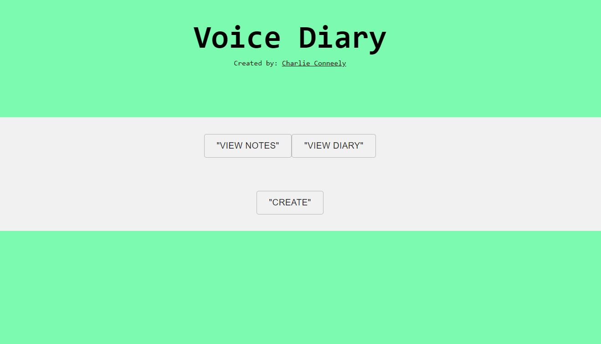

## Gesture Based UI Development - Final Project - G00348887
### A voice-controlled application written in React JS. 
### Create notes, diary entries, and navigate the user interface using voice commands alone.



**Get Started:**
```
npm install
npm start
```

**Dependencies:**
* `react-speech-recognition`
* `words-to-numbers`
* Material-UI